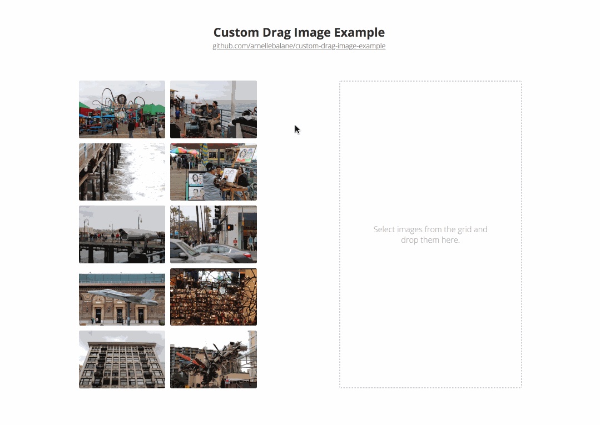

# Drag and Drop API: Custom Drag Image

Demo on how to set a custom drag image with the [Drag and Drop API][1].

[See live demo][2]



## Running this project

```bash
$ git clone https://github.com/arnellebalane/custom-drag-image-example
$ cd custom-drag-image-example
$ npm install
$ npm start         # Runs project on localhost:5000
$ npm run build     # Builds files for deployment inside `build` directory
```

## Related

- [Drag and Drop Example][3] ([live demo][4])

[1]: https://developer.mozilla.org/en-US/docs/Web/API/HTML_Drag_and_Drop_API
[2]: https://custom-drag-image-example.arnelle.dev
[3]: https://github.com/arnellebalane/drag-and-drop-example
[4]: https://drag-and-drop-example.arnelle.dev
